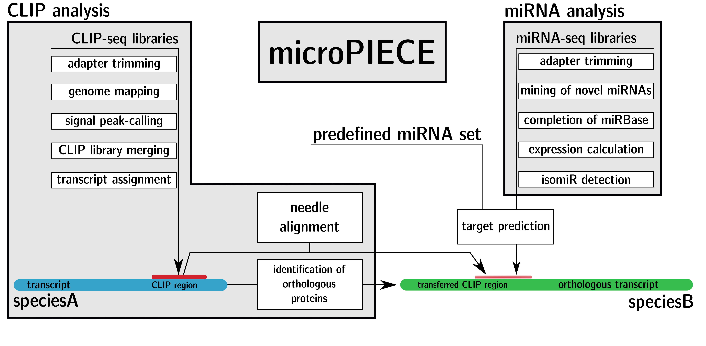

# Summary
MicroRNAs are post-transcriptional fine-regulators. With a length of around 21 nucleotides, they form a RNA-induced silencing complex (RISC) complex with a protein of the Argonaute family. This complex then binds to the mRNA UTR and CDS regions and in general promotes degradation or translational inhibition. It is now interesting to know the microRNA-mRNA pairs in order to infer dysregulating effects on the organism. In order to assign a microRNA to a mRNA target, various tools with different technical approaches were developed. They are mostly based on the assumption that the first eight nucleotides of the microRNA (seed region) determines the binding region on the mRNA. Some approaches also include supporting bindings in the rear part of the microRNA, others take secondary structures of the mRNA or binding energies of the mRNA-miRNA complex into account. Nevertheless, they all suffer from the statistical problem that such short target regions, can occur simply by chance in long transcript sequences. This results in a large amount of false positive predictions. A target prediction of all 430 *Tribolium castaneum* mature microRNAs from miRBase.org against all 18.534 protein coding cDNA sequences from ensembl results in 2.203.593 possible microRNA target interactions, predicted by miranda  with standard parameters. To increase the credibility, wet lab validation methods like luciferase reporter assays were adapted. The disadvantage here is that those methods are not applicable for high-throughput analysis, as they can only treat small subsets of sequence combinations. Another, more scalable method is cross-linking immunoprecipitation-high-throughput sequencing (CLIP-seq). Here, binding regions of the RISC show a specific signal in the sequencing reads that can be used to shrink the search space of miRNA target predictions, when mapping them to the transcriptome. The limitation here is the difficult technical treatment in the laboratory. This is the reason why there are only a few datasets available for human, mouse, worm and mosquito. It would now be useful, if we could simply transfer the information of a binding region, already identified by CLIP-seq, to another more or less closely related animal. This is what our pipeline is about. 

The pipeline starts with the *species_A* CLIP-seq library trimming, using cutadapt [@martin2011cutadapt]. Trimmed reads are then mapped to the genome with gsnap [@wu2005gmap] and the results are evaluated by Piranha [@uren2012site]. Then the libraries are merged into `.bed` files that show how many libraries support each genomic position, creating a file for each library-support-level. Now for each library-support-level, an assignment of each sequence to the transcriptome is performed. Outgoing from the transcript, the corresponding protein is used to discover the orthologous protein in the *species_B* by proteinortho [@lechner2011proteinortho]. This information is used as criteria to align the CLIP region from *species_A* to the orthologous transcript in *species_B* with needle [@rice2000emboss].
The miRNA analysis branch uses cutadapt [@martin2011cutadapt] to trim the adapter sequences from the sequencing libraries from species_B. The trimmed libraries are then filtered for ncRNAs using bwa [@li2009fast].The resulting files are merged into a pooled set and used for mining of novel microRNAs with miRDeep2 [@friedlander2011mirdeep2]. The pipeline then parses the result file and tries to complete missing entries from the miRBase.org database [@kozomara2013mirbase], e.g. if only one arm was previously annotated and the mining discoveres the exact position of the particular arm. Afterwards the expression of each mature miRNA, including the novel miRNAs, is calculated as ReadsPerMillion (RPM), outgoing from the non-pooled trimmed and filtered libraries. The pipeline also accounts for miRNA isoforms (isomiRs), by removing all trimmed reads, containing `N` characters and then passing the reads to miraligner from the seqbuster package [@pantano2009seqbuster]. We then perform a targetprediction with miranda [@betel2008microrna] on the previously transfered homologous CLIP regions. Homologous miRNAs were determined by a blastn [@altschul1990basic] search against all metazoan miRNAs from miRBase.org. The genomic loci were also identified by a blastn search against the genome of *species_B*.

We further used samtools [@li2009sequence] and bedtools [@quinlan2010bedtools] for file conversion.

# References
